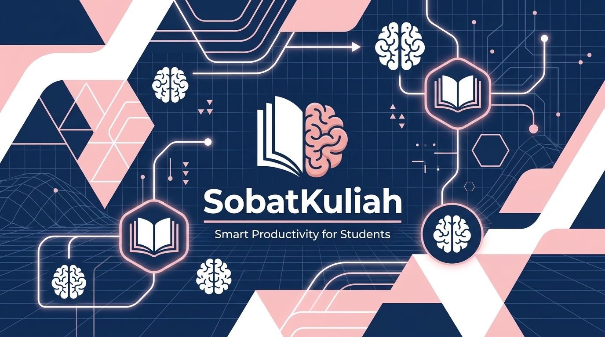

  

# 🎓 SobatKuliah (Smart College Schedule & Productivity)

  
  
  

**SobatKuliah** adalah aplikasi produktivitas yang dirancang khusus untuk mahasiswa aktif dengan jadwal padat. Aplikasi ini bertujuan membantu mahasiswa menjadi lebih terorganisir agar tidak melewatkan jadwal kelas maupun tenggat waktu tugas. Desain antarmuka mengusung konsep *startup aesthetic* yang *clean* dan modern (terinspirasi dari Notion, Google Calendar, dan Todoist).

### ✨ Fitur Utama (MVP)
- **🔐 Autentikasi Multijalur:** Integrasi Firebase Auth tingkat lanjut yang aman, mendukung Login/Register standar via Email & Password, serta **Google Sign-In** untuk akses cepat sekali klik. Dilengkapi juga dengan alur pemulihan *forgot password*.
- **📊 Dashboard Pintar:** Menampilkan jadwal hari ini, kelas berikutnya, *deadline* tugas terdekat, serta *countdown* presisi menuju kelas berikutnya.
- **📅 Manajemen Jadwal Kuliah:** Tambah, edit, hapus jadwal, lengkap dengan detail dosen, ruangan, catatan, dan tampilan mingguan.
- **📝 Tracker Tugas:** Pencatatan tugas dengan *deadline*, status penyelesaian, dan label prioritas (Tinggi, Sedang, Rendah).
- **🔔 Sistem Reminder:** Notifikasi cerdas saat kelas akan dimulai (30 menit sebelumnya) atau saat *deadline* tugas jatuh pada keesokan harinya.
- **🌙 Dark Mode & UI/UX:** Kenyamanan visual maksimal untuk mahasiswa dengan opsi peralihan *Light Mode* dan *Dark Mode*.

### 🛠️ Teknologi yang Digunakan
- **Frontend:** Dart / Flutter
- **Backend / Services:** Firebase (Authentication, Cloud Firestore)
- **State Management:** Provider

### 🗄️ Struktur Database (Firebase NoSQL)
Aplikasi ini menggunakan struktur *document-based* (NoSQL) pada Firebase Cloud Firestore untuk mengelola entitas data secara *real-time*. Data disimpan dalam bentuk *Collections* dan *Documents*:
*   **Collection `users`:** `uid` (Auth ID), `nama`, `email`, `universitas`, `jurusan`, `created_at`
*   **Collection `jadwal`:** `document_id`, `user_id` (Reference ke users), `nama_matkul`, `nama_dosen`, `hari`, `jam_mulai`, `jam_selesai`, `ruangan`, `catatan`
*   **Collection `tugas`:** `document_id`, `user_id` (Reference ke users), `judul`, `deskripsi`, `deadline`, `prioritas`, `status`

### 🚀 Roadmap Pengembangan (Telah Selesai)
- [x] **Phase 1:** Setup project, Login/Register (Firebase Auth + Google Sign-In), Koneksi database.
- [x] **Phase 2:** CRUD jadwal kuliah, Dashboard utama.
- [x] **Phase 3:** Tracker tugas, Sistem reminder.
- [x] **Phase 4:** Improve UI/UX, Dark mode, Responsive mobile.
- [x] **Phase 5:** Testing dan optimasi performa *real-time*.

### 🔮 Future Features (Rencana Update Selanjutnya)
- **🤖 AI Assistant:** Integrasi kecerdasan buatan untuk merespons pertanyaan seperti *"Kapan jadwal kosong saya minggu ini?"*
- **📸 Scan Jadwal dari Foto:** Ekstraksi otomatis gambar jadwal menjadi data sistem.
- **🔗 Share Jadwal Teman:** Fitur kolaborasi untuk melihat jadwal teman dan mengatur waktu belajar kelompok.

---
*Dikembangkan oleh Rive — Membantu mahasiswa menjadi lebih terorganisir.*
